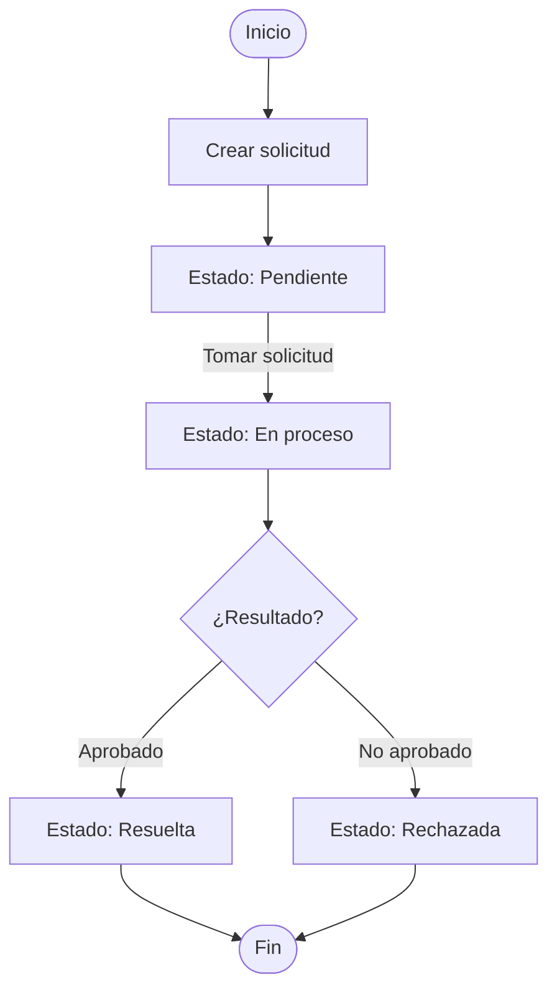

# Plantilla de Análisis — Instancia 1

> Completar **todas** las secciones a partir de [Escenario.md](Escenario.md).  
> **No leer ni modificar** `Instancia-2-Desarrollo/codigo-base/` hasta entregar este documento.  
> Candidato: _______________________

---

## 1. Resumen del problema

*¿Qué necesidad de negocio describe la entrevista? ¿Qué problema resuelve el módulo?*

**Respuesta:**
## Necesidad de negocio

La entrevista permitió identificar la necesidad de sistematizar el proceso de envío de solicitudes entre las distintas áreas de la empresa, con el objetivo de evitar la pérdida de pedidos, la desorganización, la descentralización de los canales de comunicación y la falta de seguimiento del estado de cada solicitud. Asimismo, se busca establecer un control claro sobre las áreas solicitantes y destinatarias involucradas en el proceso.

## Problema que resuelve el módulo

El módulo de **Solicitudes Internas** permite registrar cada solicitud junto con la información necesaria para su gestión, como el área solicitante, el área destinataria, el título, la descripción y la prioridad. Además, posibilita el seguimiento de cada solicitud mediante un conjunto de estados definidos (**PENDIENTE**, **EN_PROCESO**, **RESUELTA** y **RECHAZADA**), formalizando un flujo de trabajo y estableciendo qué acciones puede realizar cada actor en cada etapa del proceso.

De esta manera, el sistema reemplaza los mecanismos informales utilizados anteriormente, como **WhatsApp**, **correo electrónico** y **planillas compartidas**, los cuales presentaban riesgos de pérdida de solicitudes, falta de trazabilidad, demoras en la atención y una gestión descentralizada de los pedidos.

---

## 2. Actores

## Actores del proceso

| Actor | Rol en el proceso |
|--------|-------------------|
| **Solicitante** | Crea la solicitud y completa la información obligatoria (título, descripción, área destinataria y prioridad). Mientras la solicitud permanezca en estado Pendiente, puede editarla o eliminarla. |
| **Destinatario** | Corresponde al área responsable de atender la solicitud. Puede tomar la solicitud, cambiando su estado a **EN_PROCESO**, y posteriormente finalizar su gestión marcándola como **RESUELTA** o **RECHAZADA**. Es el único actor autorizado para modificar el estado de la solicitud. |

---

## 3. Flujo del proceso

*Representá el ciclo de vida de una solicitud (estados y transiciones). Podés usar texto, lista o diagrama.*

**Respuesta:**

---

## Descripción del diagrama

Tras la creación de una solicitud, el estado inicial es **PENDIENTE**. En este estado, la solicitud aún no ha sido tomada por el área destinataria, por lo que el área solicitante puede editarla o eliminarla.

Cuando un integrante del área destinataria toma la solicitud, su estado cambia a **EN_PROCESO**. A partir de ese momento, la solicitud queda bloqueada para su edición y únicamente el área destinataria puede continuar con su gestión.

Al final del proceso, la solicitud puede alcanzar uno de dos estados finales:

- **RESUELTA:** indica que la solicitud fue atendida y completada satisfactoriamente. En este estado el proceso concluye y la solicitud ya no puede modificarse.
- **RECHAZADA:** indica que la solicitud no será atendida. También constituye un estado final y, una vez alcanzado, la solicitud no puede reabrirse ni modificarse.

## 4. Reglas de negocio

*Listá las reglas que inferís del escenario. Separá las que están claras de las que dependen de un supuesto (§6).*

| Regla                                                                                | ¿Explícita en la entrevista? | 
|------------------------------------------------------------------------------------- |------------------------------|

 Cada solicitud inicia en estado **PENDIENTE**.                                        | Definida. |
 La solicitud puede editarse o eliminarse mientras permanezca en estado **PENDIENTE**. | Definida. |
 Cualquier modificación queda bloqueada una vez que la solicitud es tomada por el área
destinataria.                                                                          | Definida. |
Una solicitud en estado **EN_PROCESO** no puede editarse.                              | Definida. |
 Una solicitud en estado **RESUELTA** no puede editarse.                               | Definida. |
 El estado inicial cambia de **PENDIENTE** a **EN_PROCESO** cuando el área destinataria
  toma la solicitud.                                                                   | Definida. |
 No se puede reabrir una solicitud en estado **RECHAZADA**.                            | Requerimiento inconcluso; debe validarse durante el relevamiento. |
 Solo el área solicitante puede crear una solicitud.                                   | Inconclusa: no hay actualmente login, cualquier usuario puede ingresar y crear solicitud|
 Los campos **título**, **descripción**, **área solicitante**, **área destinataria** y 
 **prioridad** son obligatorios.                                                       | Definida. |
 Solo el área destinataria puede cambiar el estado de una solicitud (tomarla,
 resolverla o rechazarla).                                                             | Indefinida: no hay login, cualquier usuario podría tomar y resolverla/rechazarla |
 Los filtros de prioridad modifican el orden del listado.                              | Comportamiento aún no definido; requiere aclaración. |
 Mientras una solicitud esté en estado **PENDIENTE** no puede cancelarse; 
 únicamente puede eliminarse.                                                          | Definida según el relevamiento actual. |
 El sistema debe solicitar confirmación antes de eliminar una solicitud.               | Requerimiento pendiente de definición e implementación. |

---

## 5. Modelo de datos propuesto

*Proponé tablas y campos necesarios para soportar el proceso. No hace falta coincidir con el código todavía.*

**Respuesta:**

# Tabla: `solicitudes`

| Campo               | Tipo          | Restricciones            | Descripción |
|-------              |------         |---------------           |-------------|
| `id_solicitud`      | `INT`         | PK, AUTO_INCREMENT       | Identificador único de la solicitud. |
| `titulo`            | `VARCHAR(50)` | NOT NULL                 | Título breve de la solicitud. |
| `descripcion`       | `TEXT`        | NOT NULL                 | Descripción detallada de la solicitud. |
| `area_solicitante`  | `VARCHAR(50)` | NOT NULL                 | Área que genera la solicitud. |
| `area_destinataria` | `VARCHAR(50)` | NOT NULL                 | Área responsable de atender la solicitud. |
| `estado`            | `ENUM('PENDIENTE'
,'EN_PROCESO','RESUELTA','RECHAZADA')` | NOT NULL, DEFAULT `'PENDIENTE'` | Estado actual de la solicitud. |
| `prioridad`         | `ENUM('BAJA','MEDIA','ALTA')` | NOT NULL | Nivel de prioridad asignado a la solicitud. |
| `fecha_creacion`    | `DATETIME` | NOT NULL, DEFAULT `CURRENT_TIMESTAMP` | Fecha y hora de creación del registro. |
| `fecha_actualizacion` | `DATETIME` | NOT NULL, DEFAULT `CURRENT_TIMESTAMP`, `ON UPDATE CURRENT_TIMESTAMP` | Fecha y hora de la última actualización del registro. |

## Clave primaria

- **PK:** `id_solicitud`

## Restricciones

- Todos los campos son obligatorios (`NOT NULL`).
- El estado inicial de una solicitud es `PENDIENTE`.
- La fecha de creación se asigna automáticamente al crear el registro.
- La fecha de actualización se modifica automáticamente cada vez que el registro es actualizado.

---

## 6. Preguntas abiertas y supuestos

*La entrevista deja temas sin cerrar. Documentá cada uno: qué dijeron, qué suponés vos y por qué.*
## 6.1

| **Titulo**            |Cambio de orden del listado según prioridad|
|-------|-------------  |
| **Qué se dijo**       | Desde Compras se considera que las prioridades altas deberían aparecer primero. Para Administración la prioridad es meramente referencial y Mesa de Ayuda no manifiesta preferencia. |
| **Supuesto**          | Se advierte la falta de un responsable del proceso que defina el criterio de ordenamiento. |
| **Justificación**     | La entrevista evidencia falta de consenso sobre el comportamiento esperado del sistema respecto al ordenamiento por prioridad. |

---

## 6.2

| **Titulo**           |Cancelación de petición en estado Pendiente|
|-------|-------------|
| **Qué se dijo** | Administración solicita poder cancelar una petición mientras permanezca en estado Pendiente, pero actualmente solo existe la opción de borrarla. |
| **Supuesto** | Se requiere un estado **Cancelada** independiente de la eliminación física de la solicitud. |
| **Justificación** | Es un requerimiento expresado explícitamente durante la entrevista. |

---

## 6.3 

| **Titulo**          | Confusión sobre los filtros de prioridad y estado|
|-------|-------------|
| **Qué se dijo** | No está claro si los filtros consultan la base de datos o solo filtran los registros cargados. Tampoco si funcionan mediante AND u OR. |
| **Supuesto** | Se asume un comportamiento de tipo **AND**. |
| **Justificación** | El comportamiento funcional deberá confirmarse con el área de Sistemas. |

---

## 6.4 

| **Titulo**          | Confirmación antes de borrar solicitud|
|-------|-------------|
| **Qué se dijo** | Un empleado solicita que el sistema pida confirmación antes de eliminar una solicitud. |
| **Supuesto** | Se asume que se han producido eliminaciones accidentales por ausencia de confirmación. |
| **Justificación** | Una confirmación previa disminuiría el riesgo de errores del usuario. |

## 7. Requerimientos funcionales

*Tu especificación del módulo: qué debe hacer la pantalla desde la perspectiva del usuario.*

### Listado
**Respuesta:**
-Mostrar el listado de las solicitudes 
-Mostrar el estado de cada solicitud 
-Mostrar la prioridad en la columna de la solicitud

### Alta, edición y baja
**Respuesta:**

##Alta
-Registrar una nueva solicitud
-Completar los campos obligatorios: para título, descripción, área, solicitante y destinatario.
-Tanto el área solicitante como el área destinataria debe escribirse a mano.

##Edición
-La edición debe estar habilitada mientras esté en estado Pendiente.
-No debe aparecer la opción de editar si el estado pasa a estar En proceso o Resuelta/Rechazada.

##Baja
-El sistema debe permitir que se elimine una solicitud mientras esté en estado Pendiente.
-No debe aparecer la opción de borrar si la solicitud está en estado En proceso o Resuelta/Rechazada.

### Cambio de estado
**Respuesta:**

-Al crearse la solicitud debe estar en estado Pendiente
-Del lado del destinatario, debe poder tomar la solicitud, cambiando su estado a En proceso.
-El área destinataria debe poder marcar una solicitud como Resuelta
-El área destinataria debe poder marcar una solicitud como Rechazada.
-Una solicitud tomada no debe poder editarse.
-Una solicitud Resuelta no debe poder editarse.

### Filtros y orden
**Respuesta:**

-El sistema permite filtrar solicitudes por estado.
-El sistema debe permitir filtrar solicitudes por prioridad.
-Pueden combinarse los dos filtros: Prioridad y Estado
-La entrevista refleja la necesidad de definir si las solicitudes de prioridad Alta deben mostrarse primero.

---

## 8. Fuera de alcance

*¿Qué excluirías de esta versión según la entrevista?*

**Respuesta:**

-Reordenamiento de la lista según prioridad, ya que no se aclaró en la entrevista.
-El login, según la entrevista, Sistemas dijo que aún no.
-Adjuntar archivos, por decisión del área de Sistemas.
-La posibilidad de reabrir un archivo que esté en estado Rechazada, ya que no hay un concenso firme sobre si debe o no hacerse, por lo tanto, -esperar la autorizacióna antes de hacer algún cambio.
-La posibilidad de reabrir o editar una solicitud Resuelta.
-Restricción por usuario sobre quién puede tomar/Resolver/Rechazar la -solicitud, sólo se restringen las acciones dependiendo del estado. -Actualmente solo habilitado la edición o cancelación en estado Pendiente.

---

## 9. Plan para la Instancia 2 (opcional)

*Sin ver el código todavía: ¿cómo abordarías la implementación o corrección una vez tengas acceso al repositorio?*

**Respuesta:**
Una vez tenga acceso al código, intentaría entender la estructura general del proyecto, cómo están organizados los distintos módulos que la conforman y la funcionalidad 
de cada uno, así entender cómo se relacionan entre sí. Lo ejecutaría localmente para ver los logs, y observaría más profundamente los archivos involucrados, para poder saber los 
cambios a hacer y dónde, sin modificar la estructura del proyecto, y no afectar las demás funcionalidades.

---

*Fin de Instancia 1 — A partir de aquí podés trabajar en `Instancia-2-Desarrollo/`.*
